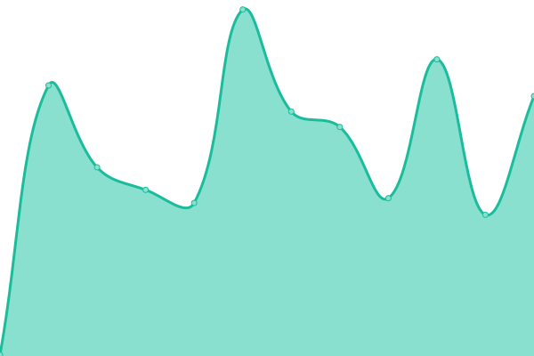
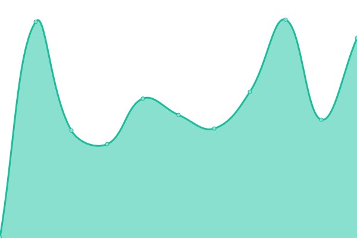
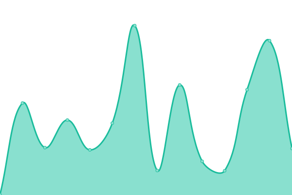
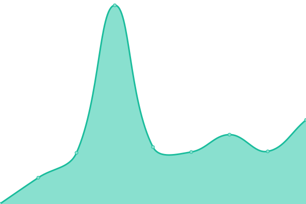

# [📈 Live Status](https://DismalShadowX.github.io/upptime): <!--live status--> **🟧 Partial outage**

This repository contains the open-source uptime monitor and status page for [Nathan Sparrow](https://everythingbagel.me), powered by [Upptime](https://github.com/upptime/upptime).

With [Upptime](https://upptime.js.org), you can get your own unlimited and free uptime monitor and status page, powered entirely by a GitHub repository. We use [Issues](https://github.com/DismalShadowX/upptime/issues) as incident reports, [Actions](https://github.com/DismalShadowX/upptime/actions) as uptime monitors, and [Pages](https://DismalShadowX.github.io/upptime) for the status page.

<!--start: status pages-->
<!-- This summary is generated by Upptime (https://github.com/upptime/upptime) -->
<!-- Do not edit this manually, your changes will be overwritten -->
<!-- prettier-ignore -->
| URL | Status | History | Response Time | All-time uptime |
| --- | ------ | ------- | ------------- | ------ |
|  [Home Web (Everything Bagel)](https://everythingbagel.me) | 🟩 Up | [home-web-everything-bagel.yml](https://github.com/DismalShadowX/upptime/commits/HEAD/history/home-web-everything-bagel.yml) | 

 346ms
     
 | 

<a href="https://status.everythingbagel.me/history/home-web-everything-bagel">100.00%</a>
    

|  [Everything Cafe](https://cafe.everythingbagel.me) | 🟩 Up | [everything-cafe.yml](https://github.com/DismalShadowX/upptime/commits/HEAD/history/everything-cafe.yml) | 

 695ms
     
 | 

<a href="https://status.everythingbagel.me/history/everything-cafe">100.00%</a>
    

|  [Everything Cloud](https://cloud.everythingbagel.me) | 🟩 Up | [everything-cloud.yml](https://github.com/DismalShadowX/upptime/commits/HEAD/history/everything-cloud.yml) | 

 585ms
     
 | 

<a href="https://status.everythingbagel.me/history/everything-cloud">100.00%</a>
    

|  [Everything Video](https://video.everythingbagel.me) | 🟩 Up | [everything-video.yml](https://github.com/DismalShadowX/upptime/commits/HEAD/history/everything-video.yml) | 

 290ms
     
 | 

<a href="https://status.everythingbagel.me/history/everything-video">100.00%</a>
    

|  [Library of Infinity](https://book.everythingbagel.me) | 🟩 Up | [library-of-infinity.yml](https://github.com/DismalShadowX/upptime/commits/HEAD/history/library-of-infinity.yml) | 

 246ms
     
 | 

<a href="https://status.everythingbagel.me/history/library-of-infinity">100.00%</a>
    

|  [Shadow Does Streams](https://stream.everythingbagel.me) | 🟩 Up | [shadow-does-streams.yml](https://github.com/DismalShadowX/upptime/commits/HEAD/history/shadow-does-streams.yml) | 

 418ms
     
 | 

<a href="https://status.everythingbagel.me/history/shadow-does-streams">100.00%</a>
    

|  [Nathan's Ramblings](https://blog.everythingbagel.me) | 🟩 Up | [nathan-s-ramblings.yml](https://github.com/DismalShadowX/upptime/commits/HEAD/history/nathan-s-ramblings.yml) | 

 308ms
     
 | 

<a href="https://status.everythingbagel.me/history/nathan-s-ramblings">100.00%</a>
    

|  [Everything Press](https://press.everythingbagel.me) | 🟩 Up | [everything-press.yml](https://github.com/DismalShadowX/upptime/commits/HEAD/history/everything-press.yml) | 

 245ms
     
 | 

<a href="https://status.everythingbagel.me/history/everything-press">100.00%</a>
    

|  [Everything Pixel](https://pixel.everythingbagel.me) | 🟩 Up | [everything-pixel.yml](https://github.com/DismalShadowX/upptime/commits/HEAD/history/everything-pixel.yml) | 

 270ms
     
 | 

<a href="https://status.everythingbagel.me/history/everything-pixel">100.00%</a>
    

|  [Pixelfed Health](https://pixel.everythingbagel.me/api/service/health-check) | 🟩 Up | [pixelfed-health.yml](https://github.com/DismalShadowX/upptime/commits/HEAD/history/pixelfed-health.yml) | 

 54ms
     
 | 

<a href="https://status.everythingbagel.me/history/pixelfed-health">100.00%</a>
    

|  [Everything Events](https://events.everythingbagel.me) | 🟩 Up | [everything-events.yml](https://github.com/DismalShadowX/upptime/commits/HEAD/history/everything-events.yml) | 

 221ms
     
 | 

<a href="https://status.everythingbagel.me/history/everything-events">100.00%</a>
    

|  [Everything Bagel (Mastodon instance)](https://everythingbagel.social) | 🟥 Down | [everything-bagel-mastodon-instance.yml](https://github.com/DismalShadowX/upptime/commits/HEAD/history/everything-bagel-mastodon-instance.yml) | 

 411ms
     
 | 

<a href="https://status.everythingbagel.me/history/everything-bagel-mastodon-instance">99.99%</a>
    

|  [Elk - Alternative Mastodon front-end](https://elk.everythingbagel.social) | 🟥 Down | [elk-alternative-mastodon-front-end.yml](https://github.com/DismalShadowX/upptime/commits/HEAD/history/elk-alternative-mastodon-front-end.yml) | 

 289ms
     
 | 

<a href="https://status.everythingbagel.me/history/elk-alternative-mastodon-front-end">99.99%</a>
    

|  [Phanpy - Alternative Mastodon front-end](https://phanpy.everythingbagel.social) | 🟥 Down | [phanpy-alternative-mastodon-front-end.yml](https://github.com/DismalShadowX/upptime/commits/HEAD/history/phanpy-alternative-mastodon-front-end.yml) | 

 310ms
     
 | 

<a href="https://status.everythingbagel.me/history/phanpy-alternative-mastodon-front-end">99.99%</a>
    

|  [Mastodon Streaming API](https://everythingbagel.social/api/v1/streaming/health) | 🟩 Up | [mastodon-streaming-api.yml](https://github.com/DismalShadowX/upptime/commits/HEAD/history/mastodon-streaming-api.yml) | 

 43ms
     
 | 

<a href="https://status.everythingbagel.me/history/mastodon-streaming-api">100.00%</a>
    

|  [Background queues](https://everythingbagel.social/sidekiq) | 🟥 Down | [background-queues.yml](https://github.com/DismalShadowX/upptime/commits/HEAD/history/background-queues.yml) | 

 111ms
     
 | 

<a href="https://status.everythingbagel.me/history/background-queues">99.99%</a>
    

|  [Wiki](https://wiki.everythingbagel.me/home) | 🟩 Up | [wiki.yml](https://github.com/DismalShadowX/upptime/commits/HEAD/history/wiki.yml) | 

 189ms
     
 | 

<a href="https://status.everythingbagel.me/history/wiki">100.00%</a>
    

|  [S3 (Media Storage)](https://ams1.vultrobjects.com) | 🟩 Up | [s3-media-storage.yml](https://github.com/DismalShadowX/upptime/commits/HEAD/history/s3-media-storage.yml) | 

 467ms
     
 | 

<a href="https://status.everythingbagel.me/history/s3-media-storage">100.00%</a>
    

|  [Mastodon Crontab](https://hc-ping.com/792e0467-b6c9-48f4-8d0a-c08664feac95) | 🟩 Up | [mastodon-crontab.yml](https://github.com/DismalShadowX/upptime/commits/HEAD/history/mastodon-crontab.yml) | 

 426ms
     
 | 

<a href="https://status.everythingbagel.me/history/mastodon-crontab">100.00%</a>
    

|  [FediFetcher Crontab](https://hc-ping.com/a14a7782-78ed-4396-b68c-ac507e95b303) | 🟩 Up | [fedi-fetcher-crontab.yml](https://github.com/DismalShadowX/upptime/commits/HEAD/history/fedi-fetcher-crontab.yml) | 

 122ms
     
 | 

<a href="https://status.everythingbagel.me/history/fedi-fetcher-crontab">100.00%</a>
    

<!--end: status pages-->

[**Visit our status website →**](https://DismalShadowX.github.io/upptime)

## 📄 License

- Powered by: [Upptime](https://github.com/upptime/upptime)
- Code: [MIT](./LICENSE) © [Nathan Sparrow](https://everythingbagel.me)
- Data in the `./history` directory: [Open Database License](https://opendatacommons.org/licenses/odbl/1-0/)
