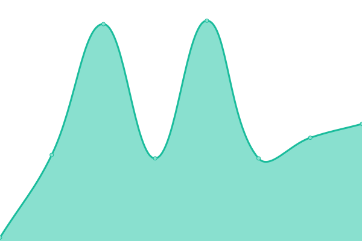
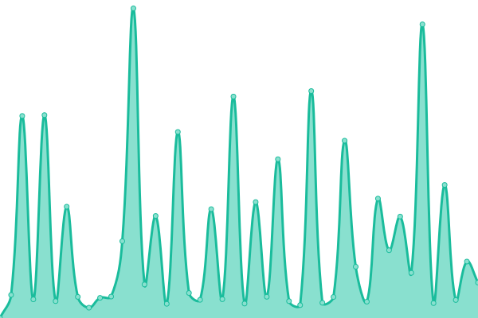

# [📈 Live Status](https://DismalShadowX.github.io/upptime): <!--live status--> **Everything is in the paws of the purrfect system!**

This repository contains the open-source uptime monitor and status page for [Nathan Sparrow](https://everythingbagel.me), powered by [Upptime](https://github.com/upptime/upptime).

With [Upptime](https://upptime.js.org), you can get your own unlimited and free uptime monitor and status page, powered entirely by a GitHub repository. We use [Issues](https://github.com/DismalShadowX/upptime/issues) as incident reports, [Actions](https://github.com/DismalShadowX/upptime/actions) as uptime monitors, and [Pages](https://DismalShadowX.github.io/upptime) for the status page.

<!--start: status pages-->
<!-- This summary is generated by Upptime (https://github.com/upptime/upptime) -->
<!-- Do not edit this manually, your changes will be overwritten -->
<!-- prettier-ignore -->
| Websites | Status | History | Response Time | All-time uptime |
| --- | ------ | ------- | ------------- | ------ |
|  [Home Web](https://everythingbagel.me) | Up and Running! 🚀 | [home-web.yml](https://github.com/DismalShadowX/upptime/commits/HEAD/history/home-web.yml) | 

 352ms
     
 | 

<a href="https://status.everythingbagel.me/history/home-web">100.00%</a>
    

|  [Shadow's Blogosphere](https://blog.everythingbagel.me) | Up and Running! 🚀 | [shadow-s-blogosphere.yml](https://github.com/DismalShadowX/upptime/commits/HEAD/history/shadow-s-blogosphere.yml) | 

 380ms
     
 | 

<a href="https://status.everythingbagel.me/history/shadow-s-blogosphere">100.00%</a>
    

|  [Mastodon Web](https://everythingbagel.social/health) | Up and Running! 🚀 | [mastodon-web.yml](https://github.com/DismalShadowX/upptime/commits/HEAD/history/mastodon-web.yml) | 

 296ms
     
 | 

<a href="https://status.everythingbagel.me/history/mastodon-web">100.00%</a>
    

|  [Mastodon Streaming API](https://everythingbagel.social/api/v1/streaming/health) | Up and Running! 🚀 | [mastodon-streaming-api.yml](https://github.com/DismalShadowX/upptime/commits/HEAD/history/mastodon-streaming-api.yml) | 

 42ms
     
 | 

<a href="https://status.everythingbagel.me/history/mastodon-streaming-api">100.00%</a>
    

|  [Pixelfed Health](https://pixel.everythingbagel.me/api/service/health-check) | Up and Running! 🚀 | [pixelfed-health.yml](https://github.com/DismalShadowX/upptime/commits/HEAD/history/pixelfed-health.yml) | 

 328ms
     
 | 

<a href="https://status.everythingbagel.me/history/pixelfed-health">100.00%</a>
    

|  [Everything Hub](https://hub.everythingbagel.me) | Up and Running! 🚀 | [everything-hub.yml](https://github.com/DismalShadowX/upptime/commits/HEAD/history/everything-hub.yml) | 

 535ms
     
 | 

<a href="https://status.everythingbagel.me/history/everything-hub">100.00%</a>
    

|  [Everything Video](https://video.everythingbagel.me) | Up and Running! 🚀 | [everything-video.yml](https://github.com/DismalShadowX/upptime/commits/HEAD/history/everything-video.yml) | 

 313ms
     
 | 

<a href="https://status.everythingbagel.me/history/everything-video">100.00%</a>
    

|  [Shadow Does Streams](https://stream.everythingbagel.me) | Up and Running! 🚀 | [shadow-does-streams.yml](https://github.com/DismalShadowX/upptime/commits/HEAD/history/shadow-does-streams.yml) | 

 423ms
     
 | 

<a href="https://status.everythingbagel.me/history/shadow-does-streams">100.00%</a>
    

|  [Everything Press](https://press.everythingbagel.me) | Up and Running! 🚀 | [everything-press.yml](https://github.com/DismalShadowX/upptime/commits/HEAD/history/everything-press.yml) | 

 290ms
     
 | 

<a href="https://status.everythingbagel.me/history/everything-press">100.00%</a>
    

|  [Everything Event](https://events.everythingbagel.me) | Up and Running! 🚀 | [everything-event.yml](https://github.com/DismalShadowX/upptime/commits/HEAD/history/everything-event.yml) | 

 289ms
     
 | 

<a href="https://status.everythingbagel.me/history/everything-event">100.00%</a>
    

|  [Elk](https://elk.everythingbagel.social) | Up and Running! 🚀 | [elk.yml](https://github.com/DismalShadowX/upptime/commits/HEAD/history/elk.yml) | 

 265ms
     
 | 

<a href="https://status.everythingbagel.me/history/elk">100.00%</a>
    

|  [Phanpy](https://phanpy.everythingbagel.social) | Up and Running! 🚀 | [phanpy.yml](https://github.com/DismalShadowX/upptime/commits/HEAD/history/phanpy.yml) | 

 325ms
     
 | 

<a href="https://status.everythingbagel.me/history/phanpy">100.00%</a>
    

|  [Everything Cloud](https://cloud.everythingbagel.me/status.php) | Up and Running! 🚀 | [everything-cloud.yml](https://github.com/DismalShadowX/upptime/commits/HEAD/history/everything-cloud.yml) | 

 287ms
     
 | 

<a href="https://status.everythingbagel.me/history/everything-cloud">100.00%</a>
    

|  [In Light & In Shadow](https://scribe.everythingbagel.me) | Up and Running! 🚀 | [in-light-and-in-shadow.yml](https://github.com/DismalShadowX/upptime/commits/HEAD/history/in-light-and-in-shadow.yml) | 

 319ms
     
 | 

<a href="https://status.everythingbagel.me/history/in-light-and-in-shadow">100.00%</a>
    

|  [Helpdesk](https://support.everythingbagel.me) | Up and Running! 🚀 | [helpdesk.yml](https://github.com/DismalShadowX/upptime/commits/HEAD/history/helpdesk.yml) | 

 426ms
     
 | 

<a href="https://status.everythingbagel.me/history/helpdesk">100.00%</a>
    

|  [Background queues](https://everythingbagel.social/sidekiq/stats) | Up and Running! 🚀 | [background-queues.yml](https://github.com/DismalShadowX/upptime/commits/HEAD/history/background-queues.yml) | 

 210ms
     
 | 

<a href="https://status.everythingbagel.me/history/background-queues">100.00%</a>
    

|  [S3 Media Storage](https://ams1.vultrobjects.com) | Up and Running! 🚀 | [s3-media-storage.yml](https://github.com/DismalShadowX/upptime/commits/HEAD/history/s3-media-storage.yml) | 

 398ms
     
 | 

<a href="https://status.everythingbagel.me/history/s3-media-storage">100.00%</a>
    

|  [Dev Web](https://dev.everythingbagel.me) | Up and Running! 🚀 | [dev-web.yml](https://github.com/DismalShadowX/upptime/commits/HEAD/history/dev-web.yml) | 

 174ms
     
 | 

<a href="https://status.everythingbagel.me/history/dev-web">100.00%</a>
    

|  [The Empty](https://test.everythingbagel.me) | Up and Running! 🚀 | [the-empty.yml](https://github.com/DismalShadowX/upptime/commits/HEAD/history/the-empty.yml) | 

 222ms
     
 | 

<a href="https://status.everythingbagel.me/history/the-empty">100.00%</a>
    

<!--end: status pages-->

[**Visit our status website →**](https://DismalShadowX.github.io/upptime)

## 📄 License

- Powered by: [Upptime](https://github.com/upptime/upptime)
- Code: [MIT](./LICENSE) © [Nathan Sparrow](https://everythingbagel.me)
- Data in the `./history` directory: [Open Database License](https://opendatacommons.org/licenses/odbl/1-0/)
